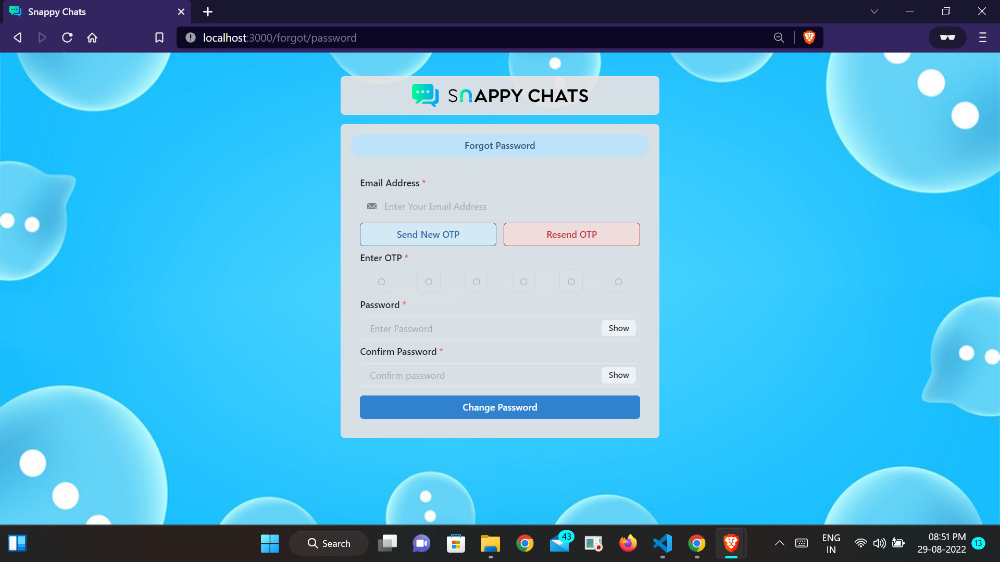

# Snappy Chats
######
### Introduction:
This is a `real-time-Chat application`, that is built on top of the `MERN Stack`.

#### Features
* Group chat and one to one chats
* Real-time notifications
* real-time messages
* Proper Authentication and warnings
#### Pages
* ##### Authentication 
  * Login Page
  
  * SignUp Page
  
  * Forgot Password Page
  
* ##### Chat Page
  * Chat Page
  
  * Edit Group Page
  
* ##### Setting Page
  * Personal
  
  * Contact
  
  * Verification
  
  * Password
  